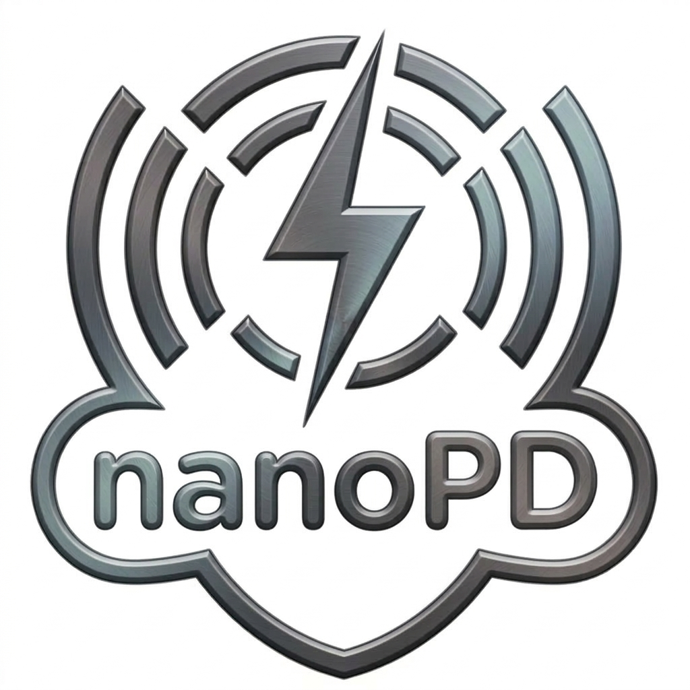

  

## 📍 Table of Contents

- [🚀 Quick Start](#-quick-start-windows)
- [✨ Features](#-features)
- [📂 Project Structure](#-project-structure)
- [📖 Documentation & Guides](#-documentation--guides)
  - [SRAM Monitor Interpretation Guide](guides/SRAM_Monitor_Guide.md)
  - [XIAO RP2350 Telemetry Research](guides/xiao_rp2350_telemetry_research.md)
  - [XIAO RP2350 Reset Behavior](guides/xiao_rp2350_reset_behavior.md)
  - [RP2350 Peripherals & Register Analysis Guide](guides/Peripherals_Guide.md)
- [🛡️ Repository Rules](#-repository-rules)

# NanoPD 2.0

**NanoPD 2.0** is an advanced debugging dashboard and control system designed specifically for the **Seeed Studio XIAO RP2350**. It provides a premium, Streamlit-based interface for microcontroller file management, real-time memory monitoring, peripheral bit-level analysis, and low-level hardware interaction.

---

## 🚀 Quick Start (Windows)

This project is optimized for stability and ease of use. All Python dependencies are automatically managed within a self-contained `.venv`, ensuring no interference with your system.

### 1. Download and Extract
- **Download**: Get the latest source code by selecting **Download ZIP** from the Code menu.
- **Extract**: Unzip the archive into any local folder.

### 2. One-Click Setup
- **Double-click `setup.bat`** in the project folder.
- This will automatically create the virtual environment and install all required packages.

### 3. Launch the Application
- Once setup is complete, **Double-click `run.bat`** to start the dashboard.

---

## ✨ Features

- **Modern Multi-page UI**: Built with Streamlit 1.36+ and native navigation.
- **MicroPython Filesystem Manager**: Push and Pull files directly from the MCU with interactive sync status.
- **SRAM Hybrid Monitor**: Real-time 520KB memory visualization with 10-bank detail tracking.
- **Peripheral Register Analyst**: Bit-level interactive grid for all RP2350 hardware registers using official SVD definitions.
- **Hardware Telemetry**: Accurate sensing for temperature, VSYS voltage (Battery/USB), and architecture (ARM/RISC-V) detection.

---

## 📂 Project Structure

- `main.py`: Entry point and navigation router.
- `pages/`: Individual dashboard pages (Filesystem, SRAM, Peripherals, etc.).
- `utils/`: Core backend logic and hardware scanning utilities.
- `guides/`: Technical documentation and hardware research.
- `img/`: Static assets and visual documentation.
- `setup.bat`: Environment setup script.
- `run.bat`: Application launch script.

---

## 📖 Documentation & Guides

Detailed research and interpretation manuals for NanoPD 2.0 components:

*   **[SRAM Monitor Interpretation Guide](guides/SRAM_Monitor_Guide.md)**: Learn how the hybrid scanner works and how to read the physical memory layout.
*   **[XIAO RP2350 Telemetry Research](guides/xiao_rp2350_telemetry_research.md)**: Deep dive into the hardware nuances, ADC ghosting, and voltage sensing logic.
*   **[XIAO RP2350 Reset Behavior](guides/xiao_rp2350_reset_behavior.md)**: Official documentation detailing why the RST button and USB power cycles are identical on hardware level.
*   **[RP2350 Peripherals & Register Analysis Guide](guides/Peripherals_Guide.md)**: Learn how we extract official SVD definitions for live bit-level hardware reads.

---

## 🛡️ Repository Rules

Please note that as defined in `.cursorrules`, certain items (like `.venv/`, `mcu/` code, and `firmware/` binaries) are strictly restricted from being pushed to the remote repository to maintain a clean specialized project scope.
