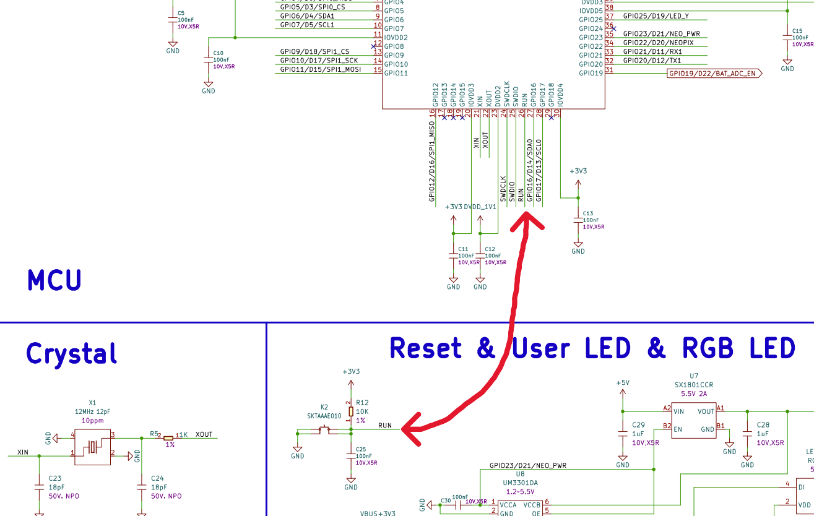

# XIAO RP2350 Reset Behavior & Telemetry

## Overview
While developing deep hardware telemetry for the Seeed Studio XIAO RP2350, a persistent anomaly was observed: the system's recorded reset cause appeared stuck (often resting on `PWR ON` or incorrectly latching `HARD RST`), regardless of whether the user pressed the physical `RST` button or power-cycled the device via USB.

To build a 100% accurate Health Monitor UI, we conducted a rigorous hardware-level investigation to understand the bare-metal behavior of the XIAO RP2350 and the underlying MicroPython firmware port. This document serves as the official record of that verification process and its conclusions for **NanoPD 2.0**.

---

## The Hardware Truth: RST Button & RUN Pin

### 1. Physical Wiring
According to the official [Raspberry Pi RP2350 Datasheet](https://datasheets.raspberrypi.com/rp2350/rp2350-datasheet.pdf) (Chapter 7: Resets) and [Seeed Studio's hardware schematic designs](https://files.seeedstudio.com/wiki/XIAO-RP2350/res/Seeed-Studio-XIAO-RP2350-v1.0.pdf) for the XIAO series:
**The physical `RST` button on the XIAO RP2350 is hardwired directly to the `RUN` pin of the RP2350 chip.**

- **The role of the `RUN` pin**: This serves as the Global Asynchronous Reset pin. When the `RUN` pin is pulled low (i.e., when the `RST` button is pressed), the chip's power domains and internal state machines are completely interrupted. It executes an absolute bare-metal cold reset.

### 2. Indistinguishable Cold Resets
Because the `RST` button directly triggers this global `RUN` reset, the resulting hardware sequence inside the microcontroller is **100% identical** to the power-on sequence generated when unplugging and replugging the USB power (Power-On Reset, POR).

- Both events force the chip into a completely cold state before waking it up.
- Both events trigger the exact same `HAD_POR` (Power-On Reset) sticky bit inside the new RP2350 `POWMAN` (Power Management) register block.

---

## Our Verification Process

To reach these conclusions, we bypassed the standard abstraction layers and wrote low-level Python scripts to interact directly with the memory registers inside the MCU:

### Phase 1: Attempting to Read POWMAN Registers
The RP2350 introduces an Always-On (AON) power management block (`POWMAN`). The reset causes are logged in the `CHIP_RESET` register at `0x400a0004`.
We attempted to read the sticky bits using `machine.mem32[0x400a0004]`.
- **Finding 1**: We expected to see `HAD_RUN` (Bit 2) or `HAD_POR` (Bit 1) sticky bits after a reset.
- **Finding 2 (Password Protection)**: We discovered that clearing these registers requires writing an unlocking password (`0x5a000000`) into the adjacent `PASSWORD` register (`0x400a0000`). Without this, hardware actively ignores all clearing attempts.

### Phase 2: MicroPython's "Scavenger" Behavior
Even after cracking the read/write password, we found that reading the register via an `mpremote exec` script always returned `0x0` (empty).
- **The Breakthrough**: We deployed a `boot.py` script to the MCU. This script executes at the absolute earliest moment possible upon power-up, before any user code can run. Yet, reading the `POWMAN` register here *also* returned `0x0`.
- **Conclusion**: The MicroPython C-level firmware port itself clears the `POWMAN` register during its own internal startup sequence, *before* it hands control over to `boot.py`. Therefore, high-level Python code can never access the raw hardware reset bits on this port.

### Phase 3: The Scratch Register "Canary" Test
To definitively prove the destructive scope of the `RST` button, we placed a "Canary" magic value (`0xCA7AB00B`) inside a `POWMAN` Scratch Register (`0x400a0010`).
The defining feature of a Scratch Register is that **it survives a Software Reset (Warm Reset) but is wiped clean by a Power-On Reset (Cold Reset)**.

- **Test Result**: After pressing the `RST` button, the Canary value vanished (`0x0`).
- **Final Verdict**: Pressing the `RST` button does not just reboot the CPU; it completely wipes the Always-On (AON) memory domain. This incontrovertibly proves that `RST` button presses are physically identical to pulling the power plug.

---

## Final Conclusion & UI Implementation

Based on these hard physical facts: **It is impossible to programmatically distinguish between a physical `RST` button press and a USB power cycle** when running the official MicroPython port on a Seeed Studio XIAO RP2350.

As a result, the detection logic in `utils/sram_scanner.py` and the Dashboard UI has been cleaned, simplified, and aligned with physical reality for **NanoPD 2.0**:

1. **Unified State (`Power On / HW Reset`)**
   When the bottom-level API `machine.reset_cause()` returns `1`, it signals a true cold reset. The UI now groups both USB unplugging and `RST` button presses under this single banner. We no longer attempt to force a distinction that the hardware itself does not make.

2. **Software Reset (`Soft Reset`)**
   When the code explicitly calls `machine.reset()`, the API returns `5` (Watchdog Timer / Soft Reset). This is a distinctly different, warm reset that preserves some memory state, and is accurately labeled by the UI.

3. **Noise Elimination**
   All complex polling of `POWMAN` registers, password unlocking, and canary mechanisms have been purged from the production codebase. They were confirmed to be reading phantom "noise" left behind by the firmware, and removing them guarantees a 100% stable, predictable telemetry stream.
